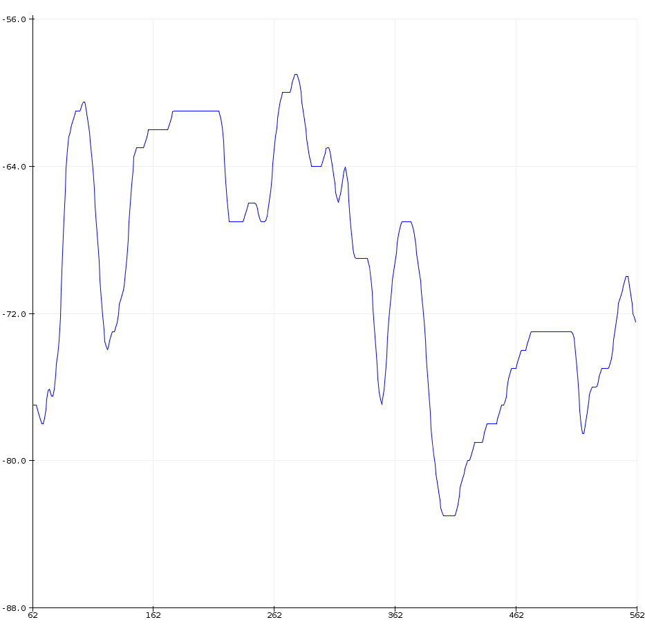

Arduino - ESP8266 WiFi Signal Strength "Sketch"

Author: jaggz.h is at gmail.com
  Date: 2017-05-11

Includes:
  wifi-loc.ino             Main code
  circle_buffer.h         Generic c++ Template Circle Buffer / Ring Buffer
  wifi_config--example.h

Usage:
  1. Copy wifi_config--example.h to wifi_config.h and edit your ssid/password
  2. Upload sketch from Arduino IDE
  3. Probably should monitor the serial output first in the IDE's Serial Monitor
     -- you might need to reset the ESP after uploading the sketch
  4. Once connected and data is coming in, close the serial monitor
     and pop up the plotter
  

* Notes:
circle_buffer.h is a simple class (CBuf) for storing the data.
